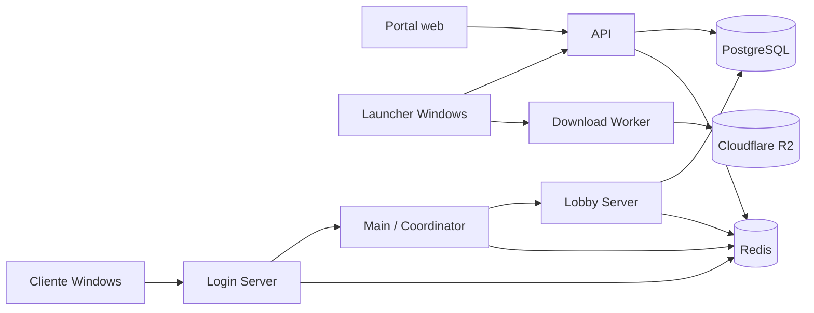

# Miraj of Icarus

Miraj of Icarus é um MMORPG de fantasia desenvolvido como uma plataforma
multicomponente: portal, launcher, cliente nativo, API e serviços de jogo
evoluem sobre contratos compartilhados e uma infraestrutura reproduzível.

O repositório adota um monorepo para manter código, contratos, assets,
automação e documentação próximos das partes que os utilizam. O README raiz
apresenta o produto e sua arquitetura; cada componente mantém suas próprias
instruções de instalação, execução, testes e publicação.

## Arquitetura



O sistema é separado em dois planos:

- **plano de produto:** portal, launcher e cliente apresentam a experiência ao
  jogador;
- **plano de serviços:** API, Login, Main/Coordinator e Lobby controlam contas,
  sessões, servidores e personagens.

A API é a autoridade de escrita para contas e personagens. PostgreSQL mantém
os dados persistentes; Redis armazena sessões, tickets e coordenação efêmera.
O cliente recebe releases imutáveis do R2 por meio de um Worker que protege os
arquivos privados e suporta downloads parciais.

## Tecnologias

| Área | Tecnologias principais |
| --- | --- |
| Portal | Next.js 16, React 19, TypeScript, Tailwind CSS e TanStack Query |
| API e serviços | .NET 10, ASP.NET Core e Entity Framework Core |
| Dados | PostgreSQL e Redis |
| Launcher e cliente | C++20, CMake, Ninja e Wicked Engine |
| Edge e distribuição | Cloudflare Workers, OpenNext e R2 |
| Infraestrutura | Docker Compose, Caddy e AWS Lightsail |
| Automação | GitHub Actions, GHCR e Git LFS |

## Organização do repositório

```text
apps/
├── game/
│   ├── mobile/          # cliente móvel
│   └── windows/         # launcher e cliente Windows
└── portal/
    └── web/             # PWA, landing page e áreas autenticadas
backend/
├── api/                 # contas, sessões, personagens e administração
├── download-worker/     # distribuição pública e autenticada de releases
├── game-server/         # Login, Main/Coordinator e Lobby
└── infra/               # Compose, proxy, deploy e operação
legacy/                  # material histórico isolado da aplicação atual
```

## Documentação por componente

- [API](backend/api/README.md)
- [Download Worker](backend/download-worker/README.md)
- [Game Server](backend/game-server/README.md)
- [Infraestrutura](backend/infra/README.md)
- [Portal web](apps/portal/web/README.md)
- [Cliente Windows](apps/game/windows/README.md)
- [Cliente mobile](apps/game/mobile/README.md)

## Princípios técnicos

- contratos de rede explícitos e versionados;
- credenciais e tokens fora do código e do armazenamento do navegador;
- releases versionadas por Git SHA e publicadas de forma atômica;
- serviços persistentes isolados da internet sempre que possível;
- regras de domínio centralizadas para evitar implementações divergentes;
- integração contínua proporcional a cada componente alterado.

## Desenvolvimento

Os requisitos e comandos variam por componente. Comece pelo README do módulo
em que irá trabalhar. Para executar a plataforma completa localmente, consulte
o [guia de infraestrutura](backend/infra/README.md).

Não versione arquivos `.env`, chaves privadas, tokens ou credenciais. Assets
binários grandes devem permanecer sob Git LFS.
